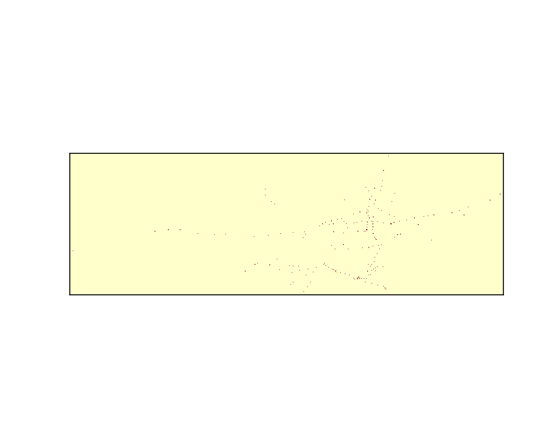
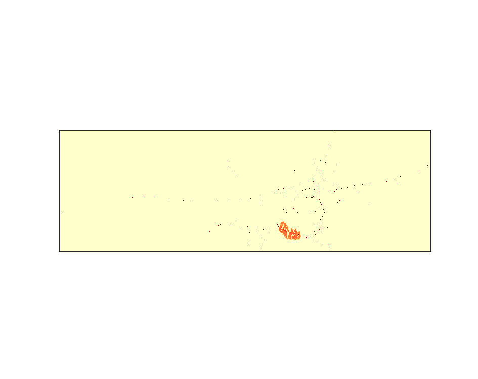
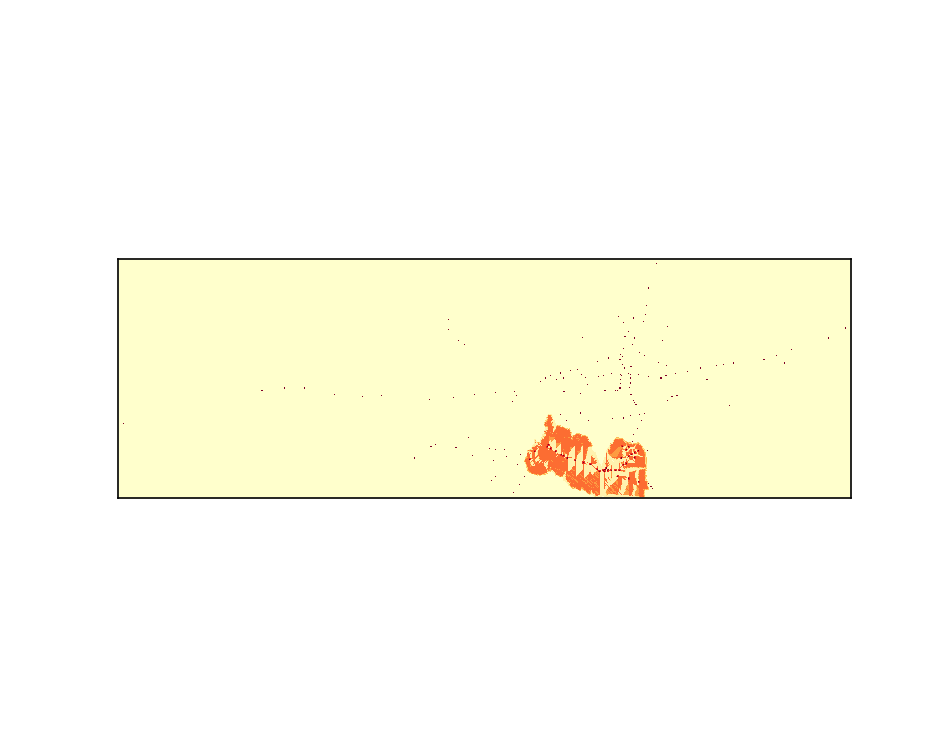
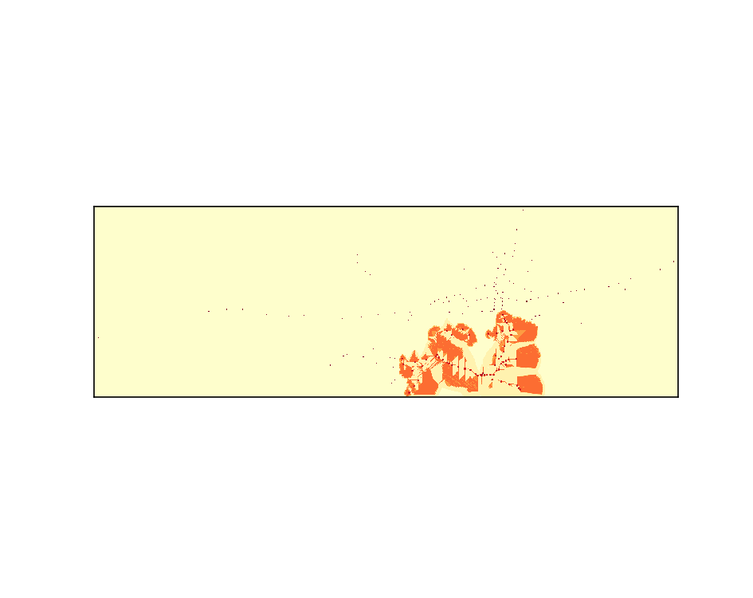
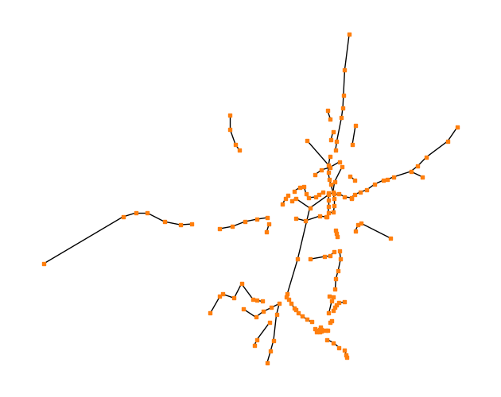
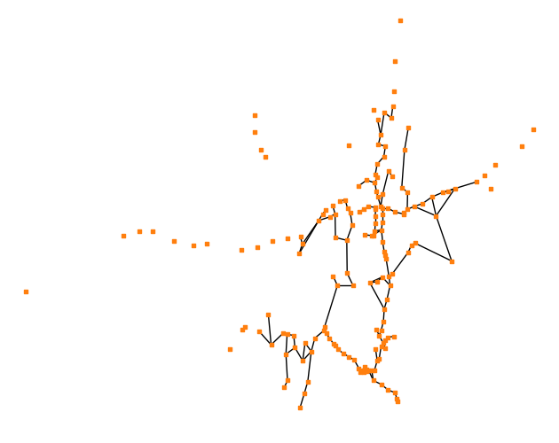

## Setup this project

1. Installing [conda](https://conda.io/projects/conda/en/latest/user-guide/install/index.html)
2. Creating conda environment
    - `conda env create -f environment.yml`
3. Activating the environment
    - `conda activate slime`
4. Updating the environment
    - `conda env update --name slime --file environment.yml --prune`

## Example output animations

   
  

  
  

## Network comparison

